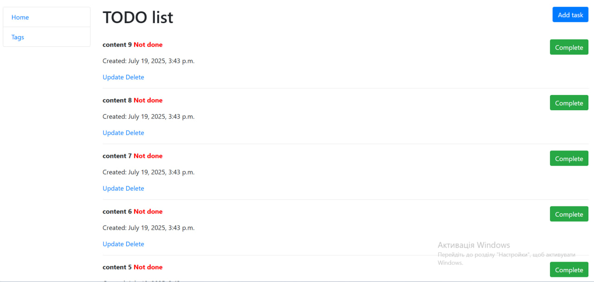

# TODO list
Django project for managing task

## Installing / Getting started
```shell
git clone https://github.com/sashasyrota/TodoList.git
python -m venv venv
venv\Scripts\activate (on Windows)
pip install -r requirements.txt
python manage.py runserver #starts Django server
```

## Features
* Managing task and tags directly from website interface

## Demo
